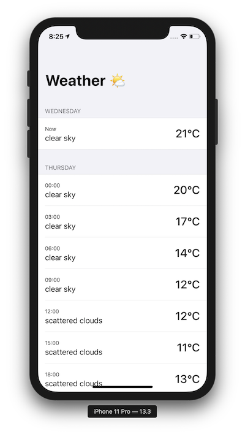
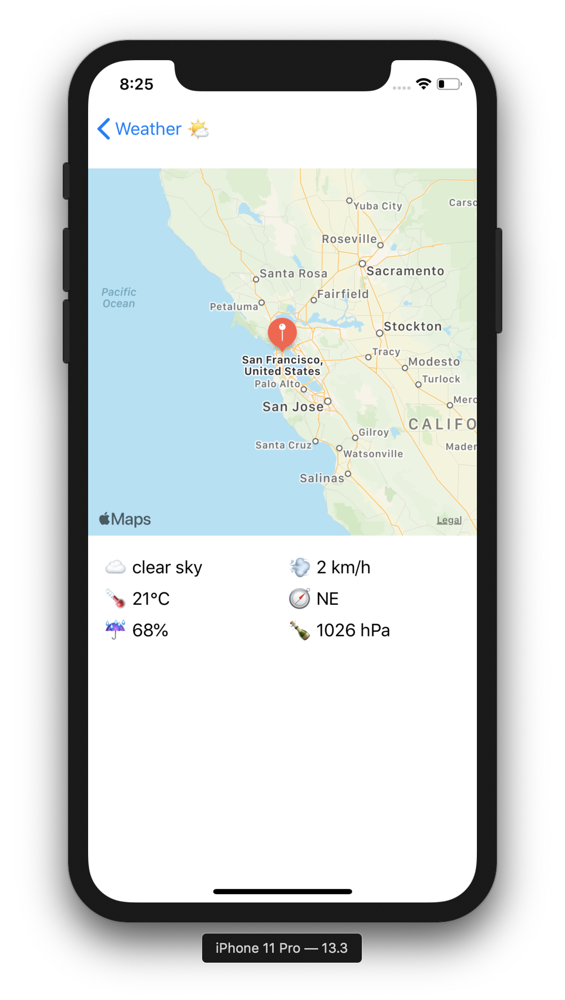

## ReactiveWeatherApp
ReactiveWeather has been developed using RxSwift and Swift 5. It presents weather based on the users location. 

## Features
* MVVM architectural pattern
* UI implemented programmatically
* Swiftlint
* Swinject 
* RxSwift
* RxCocoa
* Alamofire
* Animations
* Dark mode support

## Screenshots




## Carthage
Following cartfiles where used:

* 'Alamofire', '~> 4.8.2'
* 'Swinject', '~> 2.6.2'
* 'RxSwift', '~> 6.10.0'

## How to build

Clone the repository
```bash
$ git clone https://github.com/dawidbazan/ReactiveWeatherApp.git
```
Install carthage
```bash
$ cd ReactiveWeatherApp
$ carthage bootstrap --platform ios
```
Open the workspace in Xcode
```bash
$ open "ReactiveWeatherApp.xcworkspace"
```

## Requirements

* iOS 13.0+
* Xcode 10.2+
* Swift 5
